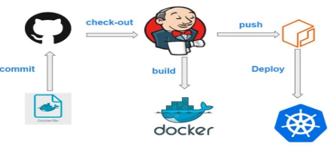

**Project:Create Build and Deploy Pipeline for K8s application deployment**

**Agenda**

- **Create Job DSL code to create, build and deploy pipeline.**
- **Create Free Style Job to Run Job DSL code to create above pipeline jobs.**
- **Build pipeline is image pipeline to build dockerfile and push image to aws elastic container**

**registry(ECR).**

- **Deploy pipeline is used to deploy the application using kubectl into k8s cluster.**
- **Outcome is an application deployed and run in k8s cluster. Able to access nginx website with url http://<ip\_address>:<port>.**
- **Keep the code stuff into the git repository.**

**Prerequisites**

- **Kubernetes**
- **Jenkins**
- **Docker**

**Architecture**

